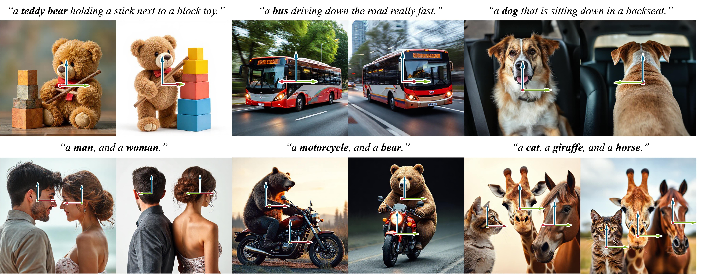

# ORIGEN: Zero-Shot 3D Orientation Grounding in Text-to-Image Generation

<!-- Title image -->

  

<!-- Badges -->

  
  

<!-- Authors -->

  <a href="https://myh4832.github.io/">Yunhong Min*</a>,
  <a href="https://choidaedae.github.io/">Daehyeon Choi*</a>,
  <a href="https://32v.github.io/">Kyeongmin Yeo</a>,
  <a href="https://jyunlee.github.io/">Jihyun Lee</a>,
  <a href="https://mhsung.github.io">Minhyuk Sung</a>
  
  

    KAIST

### 💡 Abstract

> We introduce ORIGEN, the first zero-shot method for 3D orientation grounding in text-to-image generation across multiple objects and diverse categories. While previous work on spatial grounding in image generation has mainly focused on 2D positioning, it lacks control over 3D orientation. To address this, we propose a reward-guided sampling approach using a pretrained discriminative model for 3D orientation estimation and a one-step text-to-image generative flow model. While gradient-ascent-based optimization is a natural choice for reward-based guidance, it struggles to maintain image realism. Instead, we adopt a sampling-based approach using Langevin dynamics, which extends gradient ascent by simply injecting random noise--requiring just a single additional line of code. Additionally, we introduce adaptive time rescaling based on the reward function to accelerate convergence. Our experiments show that ORIGEN outperforms both training-based and test-time guidance methods across quantitative metrics and user studies.

### 🔥 News
[2025.09] ORIGEN is accepted to NeurIPS 2025!

### 🚀 Code: Coming Soon!
